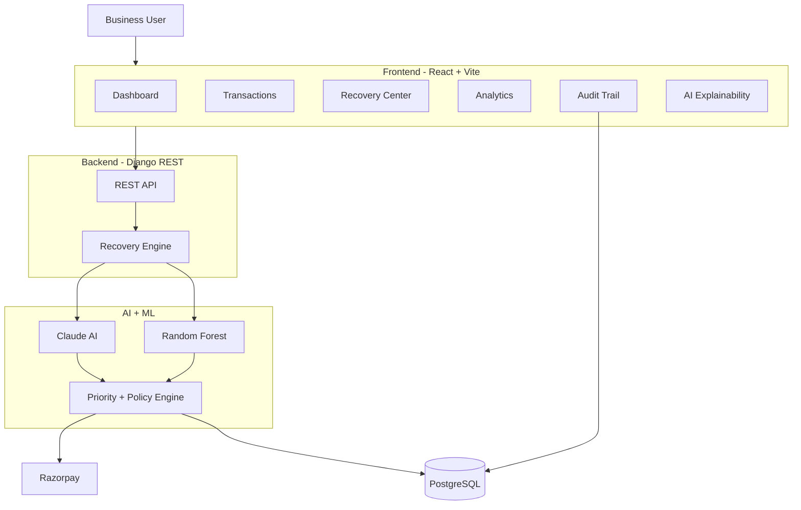

# 💰 AI Revenue Recovery

> AI-powered payment recovery platform that detects failed payments, diagnoses failure reasons, predicts recovery probability, prioritizes cases, and recommends recovery actions.

**Built for Razorpay AI Buildathon 2026 — Track 03: Revenue Recovery**

---

## 🚀 Overview

Businesses lose revenue because of failed payments caused by insufficient funds, expired cards, network issues, and other failures.

Our system uses **AI + Machine Learning + Business Rules** to intelligently recover lost revenue.

### Workflow

```text
Failed Payment
      ↓
AI Diagnosis
      ↓
ML Recovery Prediction
      ↓
Priority Scoring
      ↓
Policy Engine
      ↓
Recovery Action
      ↓
Audit Trail
```

---

## ✨ Features

- 🤖 **AI Failure Diagnosis** — Claude analyzes why a payment failed.
- 🧠 **ML Recovery Prediction** — Random Forest predicts recovery probability.
- 🎯 **Priority Scoring** — Ranks cases from Critical to Low.
- ⚡ **Automated Recovery** — Retry, Reminder, Payment Link, Escalation.
- 📊 **Analytics Dashboard** — Revenue at risk, recovered revenue, recovery rate.
- 💳 **Payment Analytics** — Payment methods, customer segments, monthly trends.
- 🔎 **Transaction Explorer** — Search and filter failed transactions.
- 🧾 **Audit Trail** — Tracks AI decisions, actions, and results.
- 🔔 **Notifications** — Recovery status updates.
- 🌙 **Dark Mode + Responsive UI**

---

## 🏗️ Architecture



---

## 🛠️ Tech Stack

| Layer | Technology |
|---|---|
| Frontend | React 18, Vite, Tailwind CSS |
| Charts | Recharts |
| Backend | Django, Django REST Framework |
| Database | PostgreSQL / SQLite |
| AI | Anthropic Claude |
| ML | Scikit-learn |
| Data | Pandas, NumPy |
| Model | Random Forest |
| Deployment | Vercel + Render |

---

## 🧠 ML Model

**Algorithm:** Random Forest Classifier

### Features

```text
Transaction Amount
Retry Count
Payment Method
Failure Reason
Customer Segment
```

**Training Data:** 650 synthetic transactions  
**Documented Accuracy:** 66.67%

---

## 🔌 API Endpoints

| Method | Endpoint | Description |
|---|---|---|
| GET | `/api/recovery/metrics/` | Dashboard metrics |
| GET | `/api/recovery/transactions/` | All transactions |
| POST | `/api/recovery/run/` | Run recovery workflow |
| GET | `/api/recovery/audit/` | Audit logs |
| GET | `/api/recovery/ai/analyze/:id` | AI transaction analysis |

### Example Response

```json
{
  "totalAtRisk": 68240,
  "recovered": 22179,
  "recoveryRate": 32.5,
  "activeCases": 9
}
```

---

## 📁 Project Structure

```text
AI Revenue Recovery/
│
├── backend/
│   ├── config/
│   ├── api/
│   ├── recovery/
│   └── manage.py
│
├── frontend/
│   └── src/
│       ├── pages/
│       ├── components/
│       ├── services/
│       └── App.jsx
│
├── data/
│   └── payments.csv
│
├── models/
│   ├── train_model.py
│   └── recovery_model.pkl
│
└── docs/
    └── screenshots/
```

---

## ⚙️ Setup

### Backend

```bash
cd backend

python -m venv venv

# Windows
venv\Scripts\activate

pip install -r requirements.txt

python manage.py migrate
python manage.py runserver
```

### Frontend

```bash
cd frontend

npm install
npm run dev
```

### Train Model

```bash
python models/train_model.py
```

---

## 🔐 Environment Variables

Create a `.env` file in the backend:

```env
ANTHROPIC_API_KEY=your_api_key
DATABASE_URL=your_database_url
```

> ⚠️ Never commit API keys or secrets to GitHub.

---

## 📸 Screenshots

### Dashboard


### Payment Analytics


### AI Explainability


### Audit Trail


---

## 🚀 Deployment

### Frontend — Vercel

```bash
npm run build
npx vercel --prod
```

### Backend — Render

**Build Command**

```bash
pip install -r requirements.txt
```

**Start Command**

```bash
gunicorn config.wsgi:application
```

---

## 🎯 Why This Project?

Unlike a traditional failed-payment system, our platform follows a complete intelligent recovery pipeline:

```text
Detect
  ↓
Diagnose
  ↓
Predict
  ↓
Prioritize
  ↓
Decide
  ↓
Recover
  ↓
Audit
```

It combines:

- AI diagnosis
- ML recovery prediction
- Priority scoring
- Business rules
- Automated recovery
- Complete auditability

### 💡 Core Value

> **Recover the payments with the highest recovery potential instead of treating every failed payment the same way.**

---

## 🏆 Built For

**Razorpay AI Buildathon 2026**

### Track 03 — Revenue Recovery

> **"Find revenue that's slipping away and win it back."**

---

## 🔮 Future Improvements

- Real Razorpay payment execution
- Larger production datasets
- Automated retry scheduling
- A/B testing of recovery strategies
- Advanced fraud/risk signals
- Recovery ROI analytics
- Real-time payment webhooks
- Explainable ML predictions

---

## 📄 License

MIT License

---


---

## ⭐ Final Value Proposition

> **Detect → Diagnose → Predict → Prioritize → Recover → Audit**

**Built with ❤️ for Razorpay AI Buildathon 2026.**
